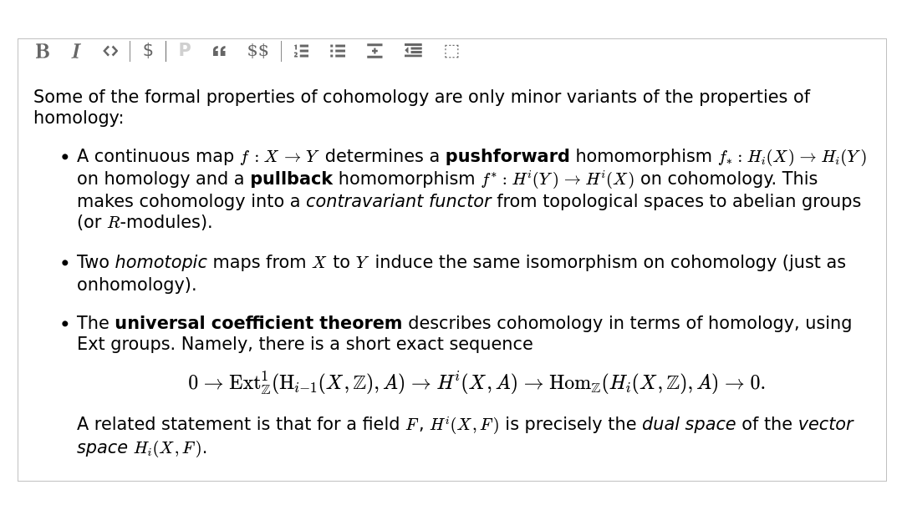

# Marble edit

Rich-text editor for project [MATF Rokovi](https://rokovi.ubavic.rs). Based on [ProseMiror](https://prosemirror.net/) and [prosemirror-math](prosemirror-math)

## Usage

In repository folder run `npm install` to install are required dependencies. Then run `npm run build` to build `marble.js` inside `public/` folder. You can test editor it by opening [`index.html`](./public/index.html)
